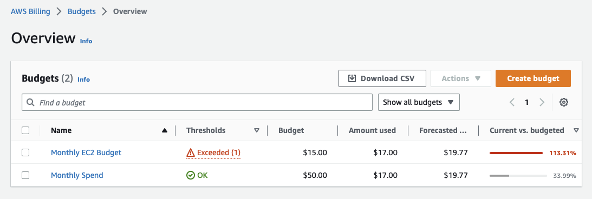
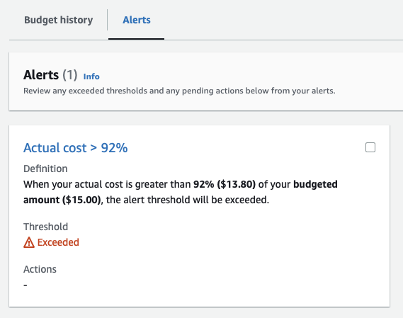
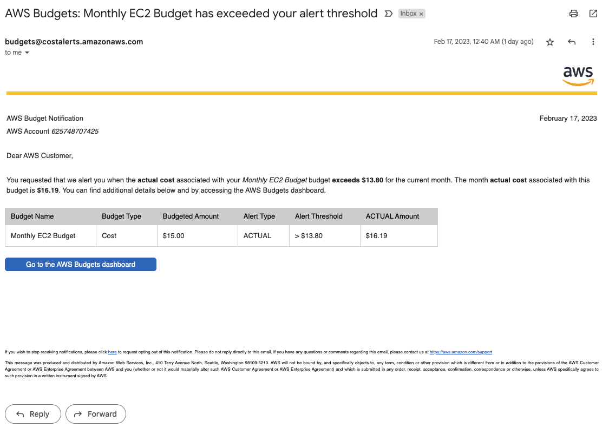
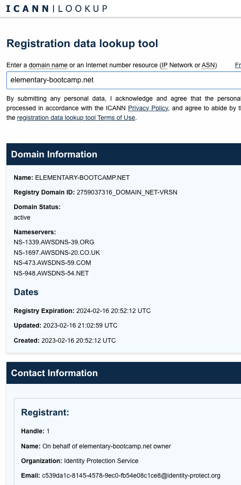

# Week 0 — Billing and Architecture

## Required Homework/Tasks

### Install and Verify CLI

I had CLI previously installed, here's my iTerm terminal in the GitHub local dir showing the version

### Create an AWS Budget

I previously had a budget set up (learned the hard way!!) so here it is

I created a new domain name for this course, using the cheapest option that cost $11 USD, put my monthly billing over the budget and triggered an alarm and also an email:

### Create a DNS Name

