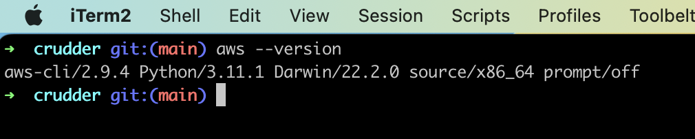
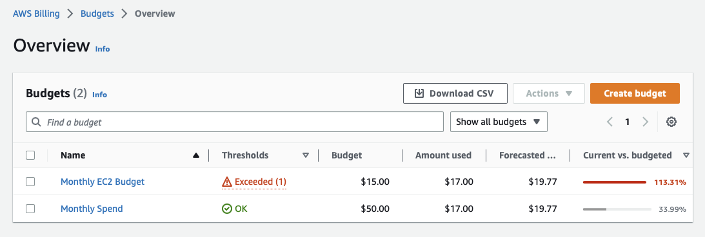
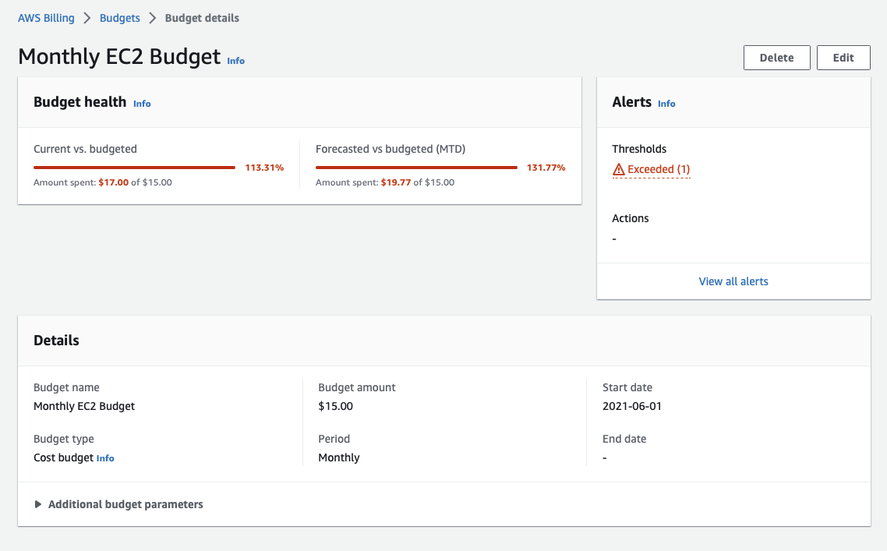
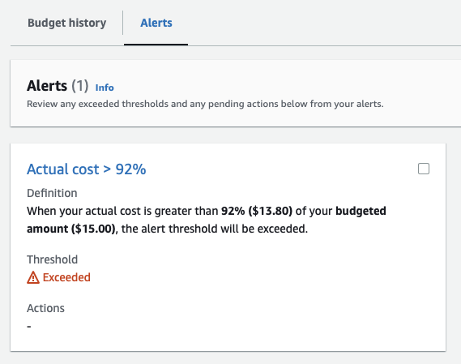
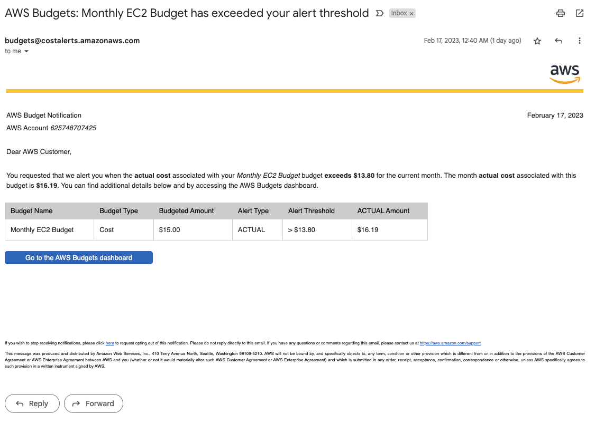
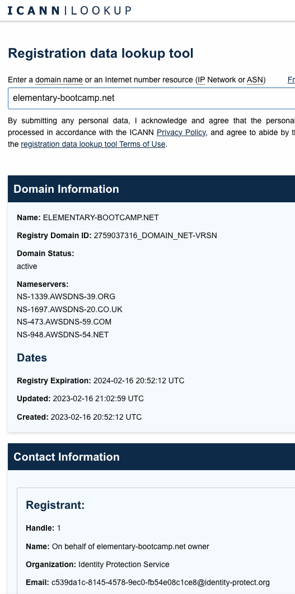

# Week 0 — Billing and Architecture

## Required Homework/Tasks

### Install and Verify CLI

I had CLI previously installed, here's my iTerm terminal in the GitHub local dir showing the version

### Create an AWS Budget

I previously had a budget set up (learned the hard way!!) so here it is

I created a new domain name for this course, using the cheapest option that cost $11 USD, put my monthly billing over the budget and triggered an alarm and also an email:

### Create a DNS Name

### Create Napkin Sketch of Logical Design

I used Microsoft Whiteboard on my iPad to sketch this out quickly

### Recreate Logical Architecture Design

[Original LucidChart Diagram](https://lucid.app/lucidchart/e4cc7951-7b8b-4664-ae0d-55eadd8c999b/edit?viewport_loc=105%2C36%2C1257%2C1131%2C0_0&invitationId=inv_03171ca6-e840-44a1-b4e6-e91a35f57989)

