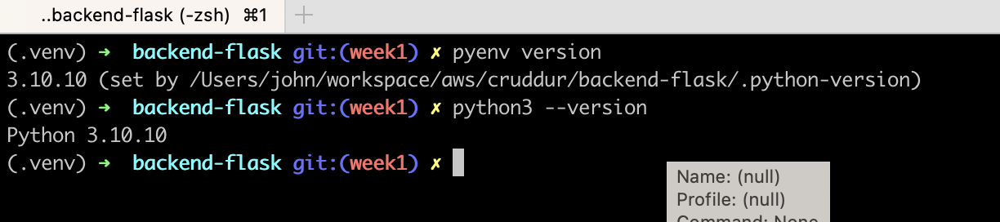
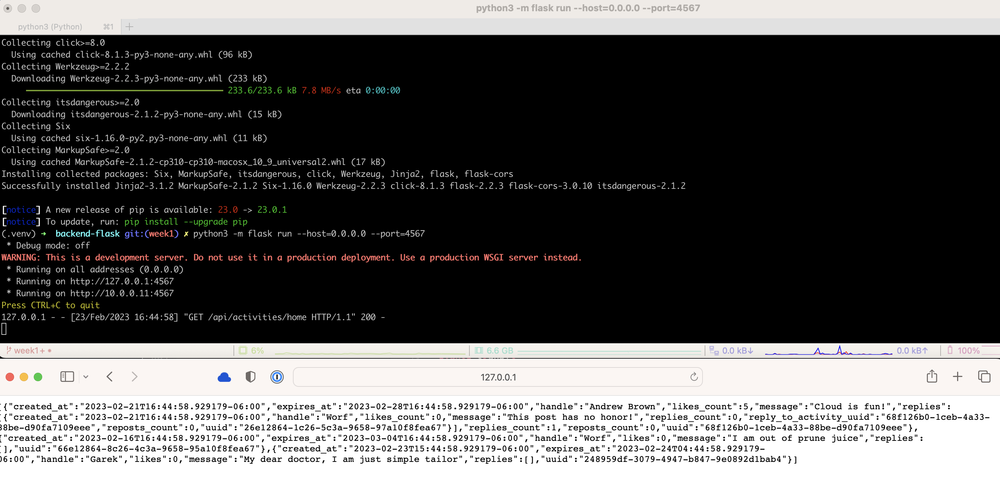
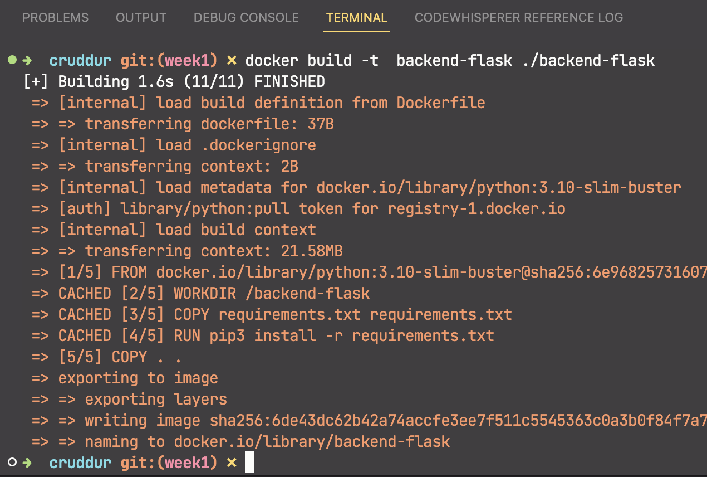
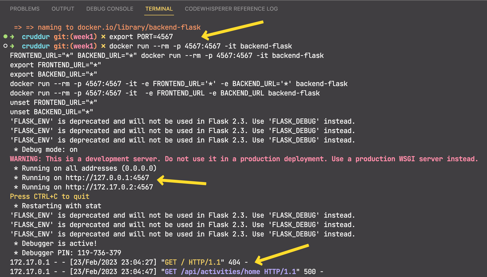

# Week 1 — App Containerization

## Required Homework/Tasks

### Setup virtual environment

I used the following commands to establish a Python virtual environment and set the Python version to use 3.10.10

```shell
pyenv install 3.10.10
python3 -m venv .venv
source .venv/bin/activate
pyenv local 3.10.10
```



### Run the backend flask site locally



### Update .gitignore

After setting up a Python virtual environment *and* running the site locally, there were almost 1,000 new files created so I hopped over to [GitHub/gitignore](https://github.com/github/gitignore/blob/main/Python.gitignore) to grab the defacto standard Python ignore file and pasted into the Cruddur version.

### Create Dockerfile

Used [Andrew's example code](https://github.com/omenking/aws-bootcamp-cruddur-2023/blob/week-1/journal/week1.md#add-dockerfile) to create the backend Dockerfile.

### Build Docker container image



### Run Docker container image

I'm getting the same results, same 500 error that Andrew showed in this week's training...


