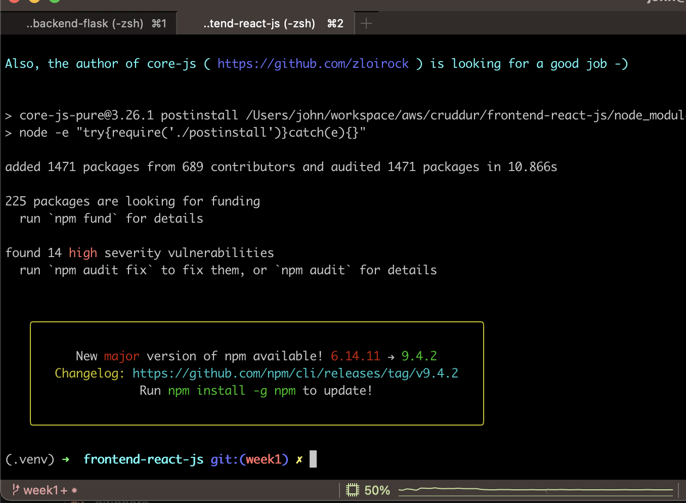
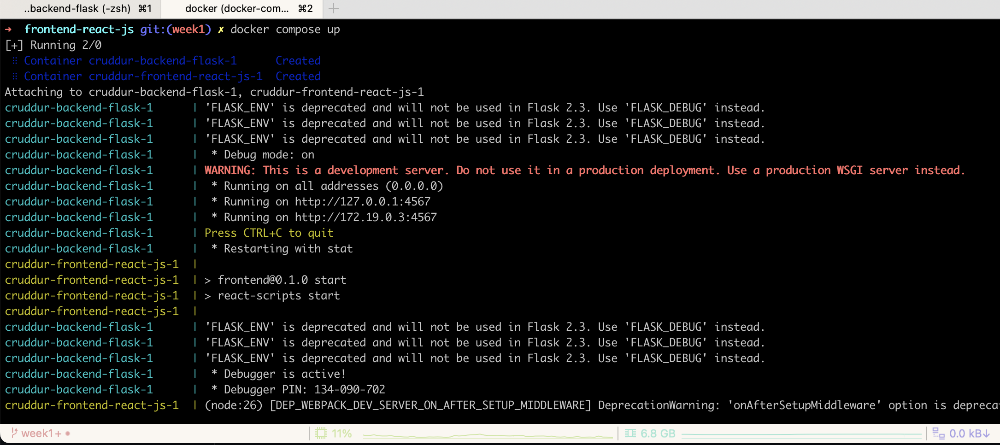
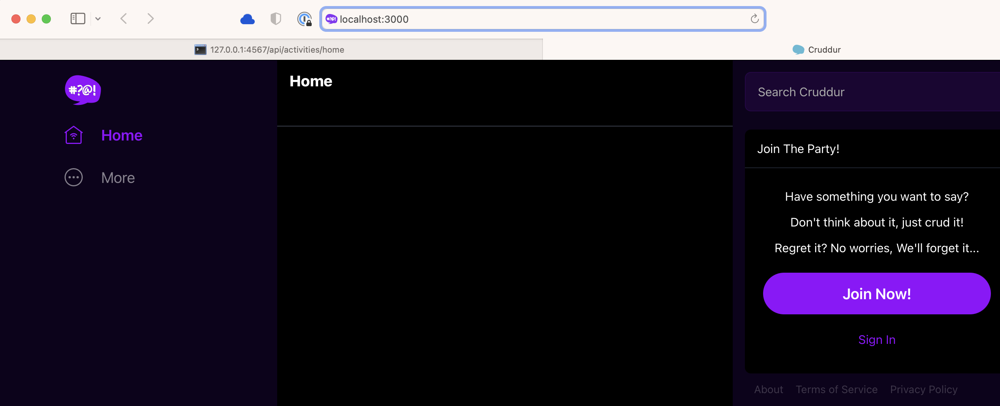
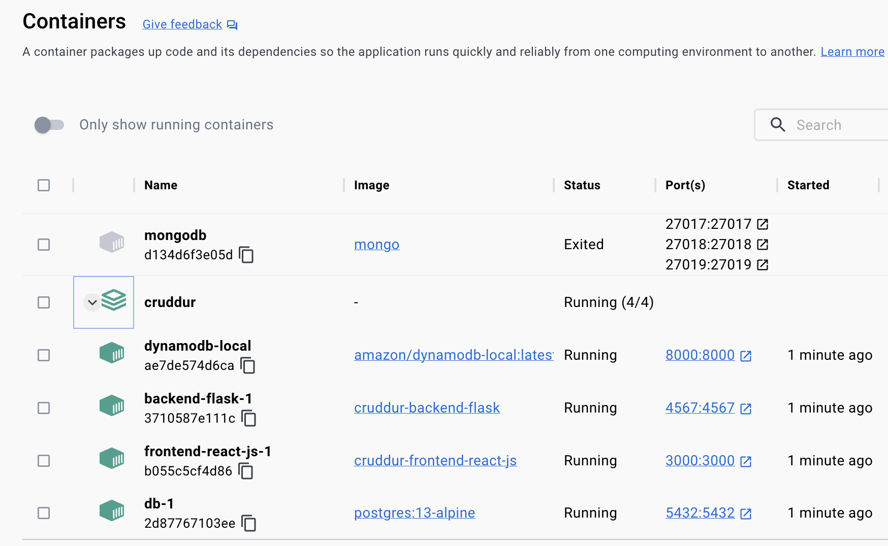
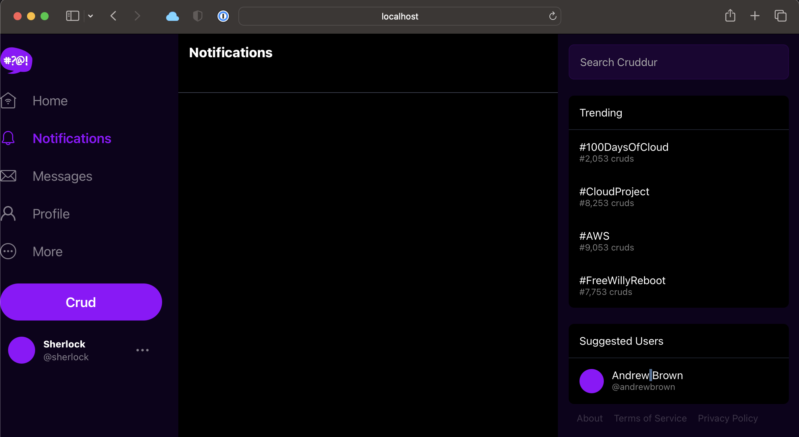
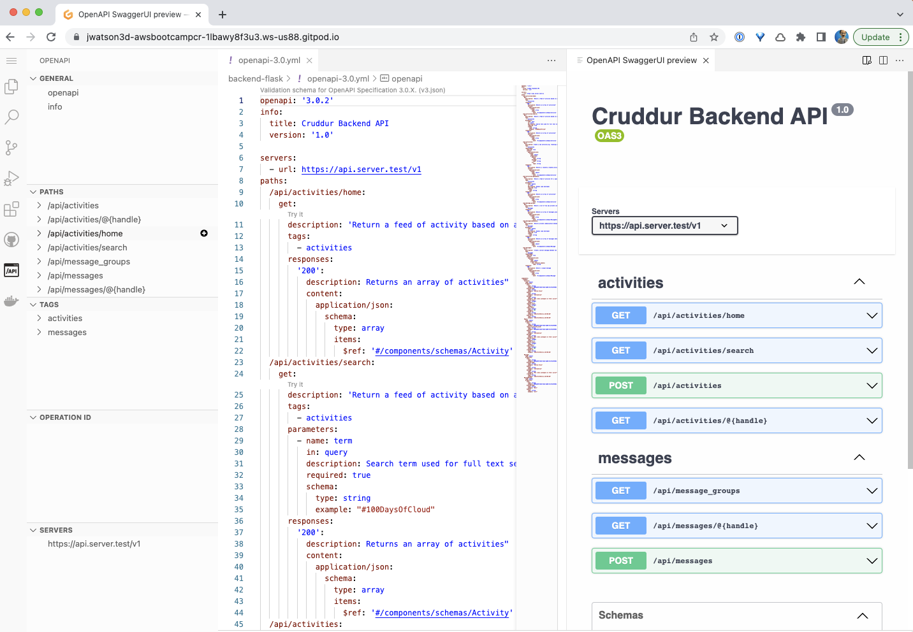

# Week 1 — App Containerization

## Required Homework/Tasks

### Setup virtual environment

I used the following commands to establish a Python virtual environment and set the Python version to use 3.10.10

```shell
pyenv install 3.10.10
python3 -m venv .venv
source .venv/bin/activate
pyenv local 3.10.10
```


### Run the backend flask site locally

Browsed to [http://127.0.0.1:4567/api/activities/home](http://127.0.0.1:4567/api/activities/home) per the training video...


### Update .gitignore

After setting up a Python virtual environment *and* running the site locally, there were almost 1,000 new files created so I hopped over to [GitHub/gitignore](https://github.com/github/gitignore/blob/main/Python.gitignore) to grab the defacto standard Python ignore file and pasted into the Cruddur version.

### Create Dockerfile

Used [Andrew's example code](https://github.com/omenking/aws-bootcamp-cruddur-2023/blob/week-1/journal/week1.md#add-dockerfile) to create the backend Dockerfile.

### Build Docker container image


### Run Docker container image

I'm getting the same results, same 500 error that Andrew showed in this week's training...


### Run Docker container image again with env vars

Stop and then restart again using the following command...

```shell
docker container run --rm -p 4567:4567 -e FRONTEND_URL="*" -e BACKEND_URL="*" -d backend-flask
```

This time it works!


### Run npm install on frontend



### Run Docker Compose

  

### Front-end website with docker compose



### Confirm running containers and images (incl. databases)




### Front-end website with notifications



### Open API - Notifications


