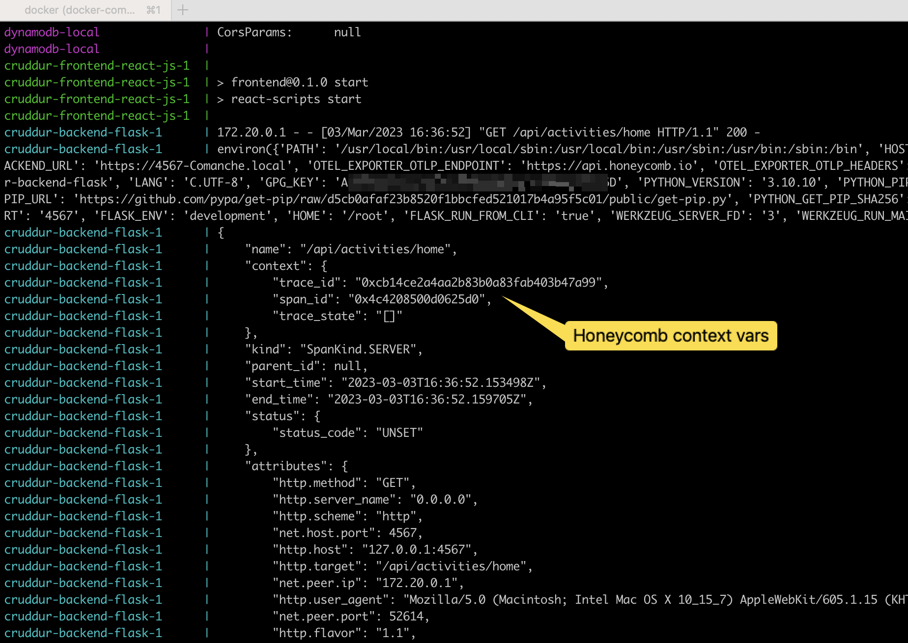
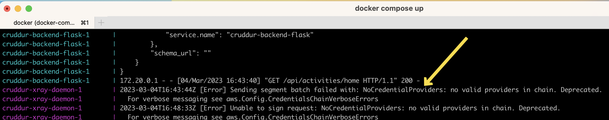
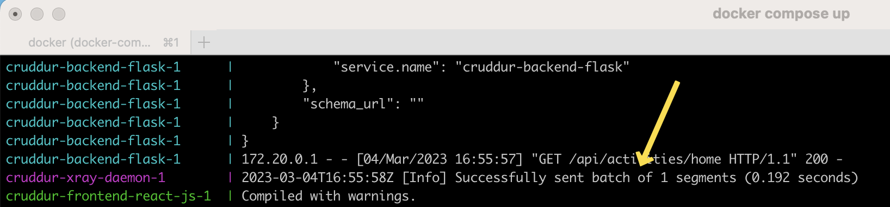

# Week 2 — Distributed Tracing

## Honeycomb

### Honeycomb Setup

I first tested backend from command line using

```python
export OTEL_EXPORTER_OTLP_ENDPOINT="https://api.honeycomb.io/"
export OTEL_EXPORTER_OTLP_HEADERS="x-honeycomb-team=************"
export OTEL_SERVICE_NAME="cruddur"
python3 -m flask run --host=0.0.0.0 --port=4567
```

<br/>Here is the output after adding the console tracing exporter:

```json
{
    "name": "/api/activities/home",
    "context": {
        "trace_id": "0x60ffe54e54427a21d8cbee9d298112b0",
        "span_id": "0x467ed6e90a77c87f",
        "trace_state": "[]"
    },
    "kind": "SpanKind.SERVER",
    "parent_id": null,
    "start_time": "2023-03-03T16:06:41.691188Z",
    "end_time": "2023-03-03T16:06:41.698339Z",
    "status": {
        "status_code": "UNSET"
    },
    "attributes": {
        "http.method": "GET",
        "http.server_name": "0.0.0.0",
        "http.scheme": "http",
        "net.host.port": 4567,
        "http.host": "127.0.0.1:4567",
        "http.target": "/api/activities/home",
        "net.peer.ip": "127.0.0.1",
        "http.user_agent": "Mozilla/5.0 (Macintosh; Intel Mac OS X 10_15_7) AppleWebKit/605.1.15 (KHTML, like Gecko) Version/16.3 Safari/605.1.15",
        "net.peer.port": 53870,
        "http.flavor": "1.1",
        "http.route": "/api/activities/home",
        "http.status_code": 200
    },
    "events": [],
    "links": [],
    "resource": {
        "attributes": {
            "telemetry.sdk.language": "python",
            "telemetry.sdk.name": "opentelemetry",
            "telemetry.sdk.version": "1.16.0",
            "service.name": "cruddur"
        },
        "schema_url": ""
    }
}
127.0.0.1 - - [03/Mar/2023 10:06:41] "GET /api/activities/home HTTP/1.1" 200 -
```

<br/>I tend to prefer individual steps when doing CLI tasks so I manually ran the Docker build command again before starting the containers up. There were all kinds of errors and it took a minute to remember the code worked from the CLI so the code wasn't the problem. I then manually deleted the containers and images and built it again and it worked correctly.




### Honeycomb Results

Email notice from Honeycomb.io about the new dataset


Dashboard showing the trace activity


<br/>Detail of same trace id shown above in the console


<br/>Diagnostic test to verify Honeycomb API key


<br/>Adding a trace span to HomeActivities.Run function


<br/>Adding custom attributes to Honeycomb trace


## AWS X-Ray

### X-Ray Setup

Ran the following command:

```shell
aws xray create-group --group-name "Cruddur" --filter-expression "service(\"backend-flash\")"
```

<br/>Produced the following output:


<br/>Verified in the AWS console:


Ran the following command:

```shell
aws xray create-sampling-rule --cli-input-json file://aws/json/xray.json
```

<br/>Produced the following output:


<br/>Initial run of containers produced no x-ray traces so I checked the logs and found this...



<br/>After setting and exporting my AWS credentials I reran the containers and it worked!



<br/>Here is the AWS X-Ray dashboard showing the traces


