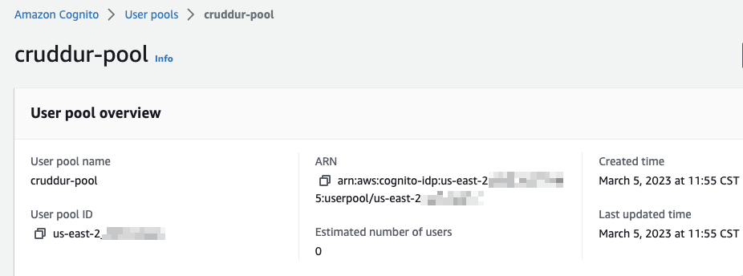
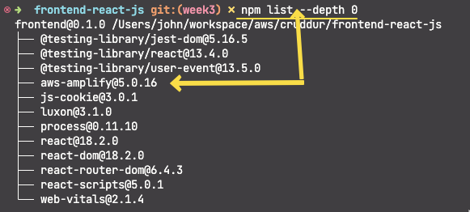
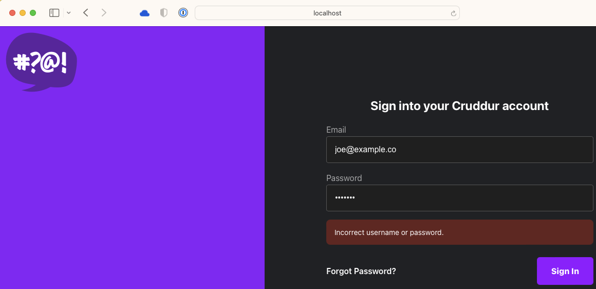
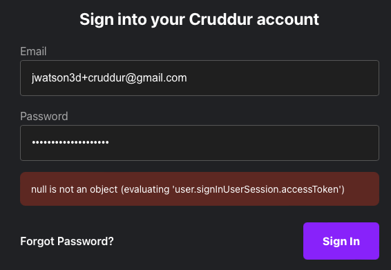
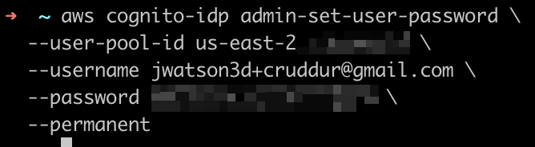
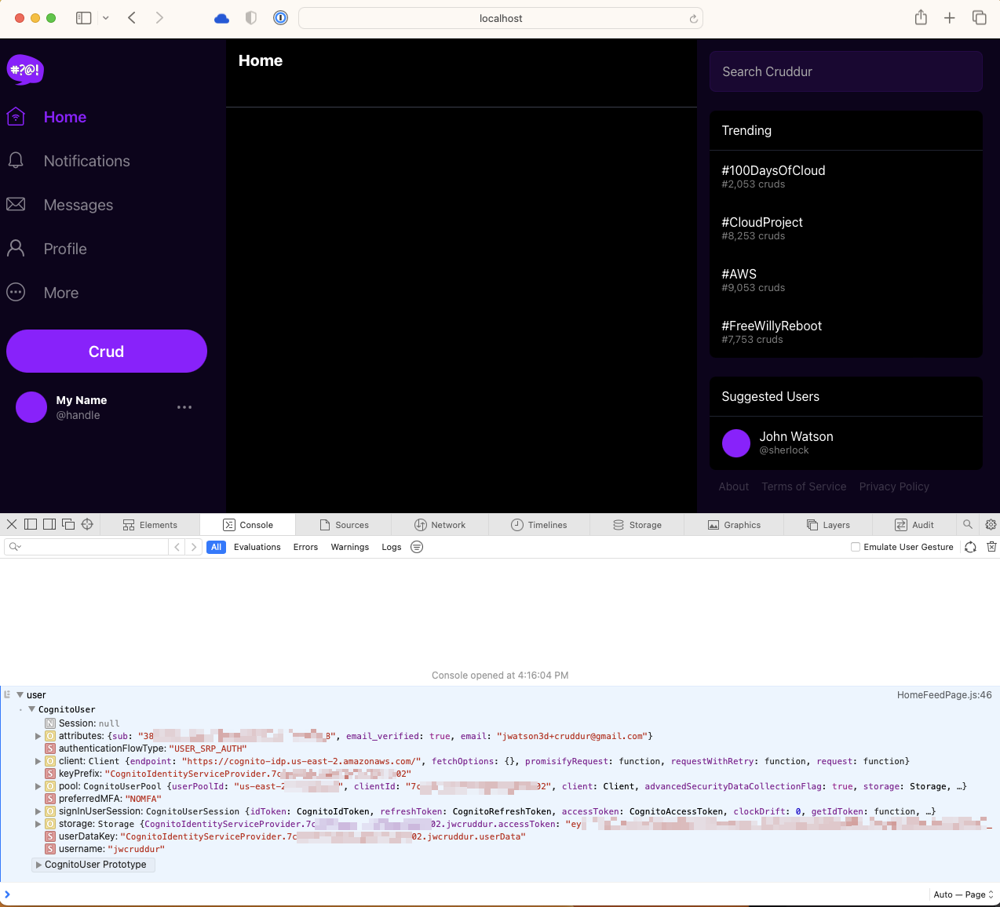

# Week 3 — Decentralized Authentication

## Cognito

### Create Cognito User Pool



### AWS Amplify Install



### AWS Cognito User Pool


### AWS Cognito Invalid User



### AWS Cognito Access Token Error



### AWS Cognito Set User Password CLI

```shell
aws cognito-idp admin-set-user-password \
  --user-pool-id <your-user-pool-id> \
  --username <username> \
  --password <password> \
  --permanent
```



### AWS Cognito Login Success


